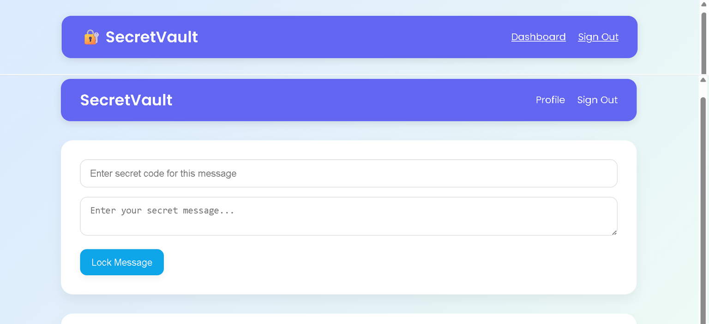
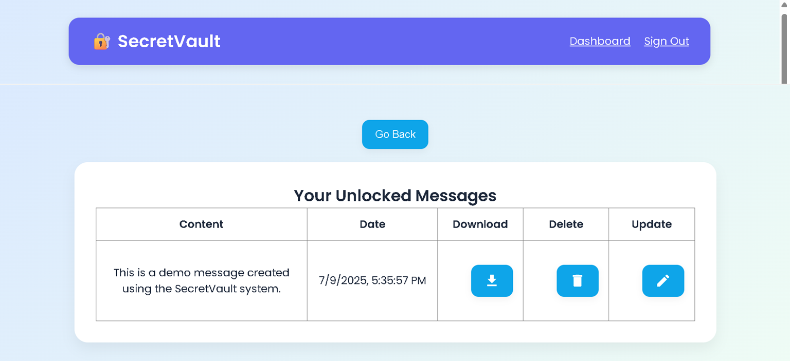

# 🔐 SecretVault – Private Message Locking System
Secure message locker system using PHP & MySQL.

**SecretVault** is a secure and easy-to-use message locking web app.  
Users can lock, unlock, and manage secret messages using a secret code.

## 📜 Features

- ✅ Sign Up / Sign In System  
- 🔒 Lock a secret message with a code  
- 🔓 Unlock messages using code  
- 📝 View, Update, and Delete messages  
- 💾 Download messages in `.txt` format  
- 📱 Fully Responsive & Clean Dashboard  
- 🛡️ Admin panel to manage users & messages  
- 👤 Profile and Change Password section  

## 🛠️ Built With

- HTML5 + CSS3  
- JavaScript (Front-end logic)  
- PHP (Back-end logic)  
- MySQL (Database)  
- Google Fonts & Material Icons  

## 📸 Screenshots

### 🏠 Home Page (index.php)

### 🔐 Dashboard (dashboard.php)

### 📋 Unlocked Messages (view.html / view.js)

### 👤 Profile Page (profile.php)

## 🚀 How to Run Locally

1. Clone the repo  
   `git clone https://github.com/mitalkatariya/secret-vault-website.git`

2. Import `sql/setup.sql` into phpMyAdmin

3. Open project in XAMPP htdocs (`C:/xampp/htdocs/secret-vault-website/`)

4. Start Apache + MySQL, then go to:  
   `http://localhost/secret-vault-website/`

---

### 🔗 Live Link (Optional)

You can host this project on Netlify (frontend only) and use free PHP host (like 000webhost or InfinityFree) for backend.

---

### 📧 Contact

Made by [Mital Katariya]  
Email: mitalkatariya2004@gmail.com  
GitHub: [mitalkatariya](https://github.com/mitalkatariya)
